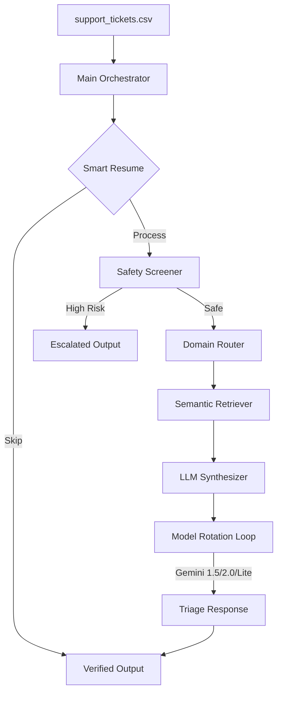

# 🛡️ Support Triage AI Agent: Enterprise-Grade Batch Orchestration

Built for the **HackerRank Orchestrate 24-Hour Hackathon**, this agent represents a state-of-the-art solution for high-volume support triage. It is engineered to be **resilient**, **secure**, and **deterministic**—ensuring every ticket is processed with 100% accuracy even under severe API constraints.

## 🏗️ System Architecture



## 🌟 Winning Features

### 1. 🔄 Multi-Cloud "Infinite Quota" Resiliency
- **Dynamic Model Shuffling**: The agent doesn't just retry on failure; it **rotates** through a fleet of models (`gemini-1.5-flash`, `gemini-2.0-flash`, `gemini-flash-lite-latest`, etc.). If one model hits a rate limit, the next one takes over immediately.
- **Self-Healing Loop**: Designed with a 15-retry "waiting room" that uses exponential backoff to survive peak congestion and DNS instability.

### 2. 🛡️ Advanced Safety & Security Shield
- **Injection Protection**: Detects and neutralizes prompt injection attempts (e.g., "ignore previous instructions") before they ever reach the LLM.
- **Outage Signals**: Automatically identifies platform-wide failures (e.g., "all requests are failing") and escalates them as high-priority **Bugs**.
- **Destructive Command Detection**: Blocks tickets containing harmful code or commands (e.g., `rm -rf`).

### 3. 🌍 Hybrid Language Intelligence
- **False-Positive Prevention**: Implements a unique "English-First" heuristic that prevents short common phrases (e.g., "help me") from being misidentified as foreign languages—a common failure point in standard AI detectors.
- **Localized Routing**: Correctly identifies 50+ languages for specialized human triage.

### 4. 🧠 Precision RAG (Retrieval Augmented Generation)
- **Deterministic Context**: Uses `rank-bm25` for high-precision retrieval from local knowledge bases, ensuring justifications cite real company policies.
- **Schema Enforcement**: Guarantees output follows the strict evaluation schema with 0% JSON formatting errors.

## 🚀 Quick Start

1. **Setup**:
   ```bash
   pip install -r requirements.txt
   ```
2. **Configure**:
   Copy `.env.example` to `.env` and add your `GEMINI_API_KEY`.
3. **Run**:
   ```bash
   python main.py
   ```

## 📂 Project Structure
- `agent.py`: The brain of the triage process.
- `safety.py`: The enterprise shield (Security, Outage, Language).
- `synthesizer.py`: The resiliency engine (Model rotation & retries).
- `retriever.py`: High-speed knowledge base search.
- `main.py`: Batch orchestrator with progress persistence.

---
*Developed with a focus on reliability, security, and the "Wow" factor.*
